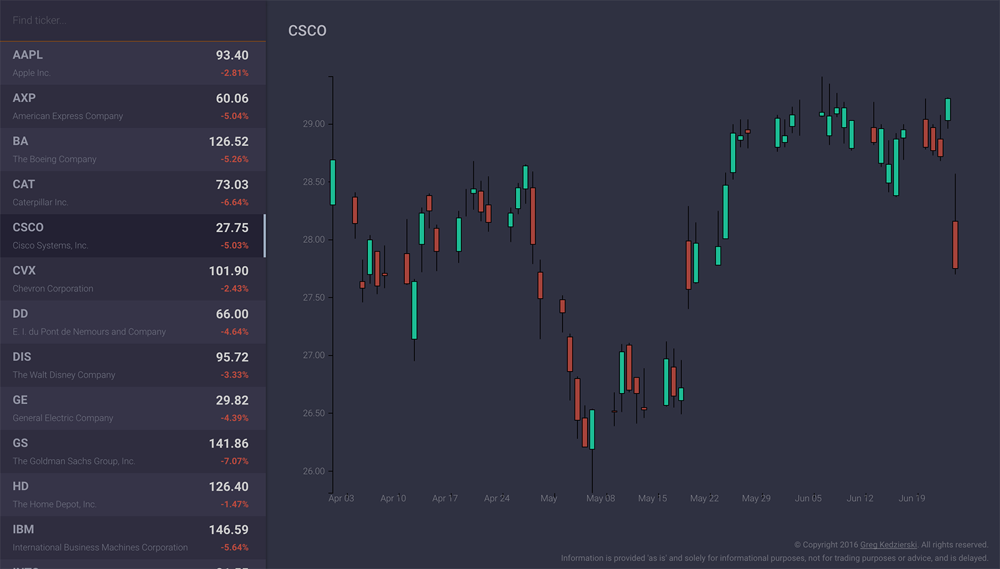

# stock-viewer

A stock viewing app.



## Build Setup

``` bash
# install dependencies
npm install

# serve with hot reload at localhost:8080
npm run dev

# build for production with minification
npm run build

# run tests
npm run test
```
